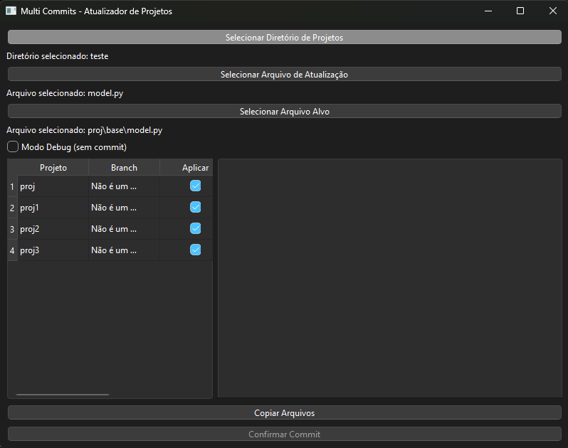

# 🚀 Multi Commits


> **Ferramenta gráfica para atualizar arquivos em múltiplos projetos Git de forma rápida, segura e automatizada.**

---

## ✨ Funcionalidades

- ✅ **Interface gráfica intuitiva** para seleção de diretórios e arquivos, exibindo caminhos relativos para maior clareza.
- ✅ **Visualização das branches** atuais de cada projeto na tabela.
- ✅ **Seleção de múltiplos projetos** para atualização (checkbox na tabela).
- ✅ **Atualização automática** de arquivos nos projetos selecionados.
- ✅ **Confirmação de commit** antes de aplicar as alterações Git.
- ✅ **Botão de reversão** pós-commit para desfazer o último commit por projeto.
- ✅ **Relatório detalhado** das operações realizadas no painel de logs.
- ✅ **Logs de erro detalhados** (tipo e mensagem da exceção) para facilitar o diagnóstico.
- ✅ **Modo Debug** para testar atualizações sem realizar commits.
- ✅ **Interface responsiva** com painéis redimensionáveis (projetos/logs).

---

## 🖥️ Pré-requisitos

- Python **3.8** ou superior
- Git instalado e configurado
- Dependências Python listadas em `requirements.txt`

---

## ⚡ Instalação

```bash
git clone https://github.com/seu-usuario/multi-commits.git
cd multi-commits
pip install -r requirements.txt
```

---

## 🛠️ Como usar

1. Execute o script:
   ```bash
   python app.py
   ```
2. Na interface gráfica:
   - 📁 Clique em **"Selecionar Diretório de Projetos"** e escolha a pasta que contém seus repositórios Git.
   - A tabela abaixo será populada com a lista de projetos, suas branches e checkboxes para seleção.
   - 📄 Clique em **"Selecionar Arquivo de Atualização"** e escolha o arquivo que contém o conteúdo a ser copiado.
   - 📄 Clique em **"Selecionar Arquivo Alvo"** e escolha o arquivo em **UM** dos seus projetos que será atualizado.  
     <sub><sup>*(Os outros projetos selecionados na tabela precisam ter uma estrutura de diretórios e nome de arquivo iguais a partir da raiz do projeto)*</sup></sub>
   - ☑️ Na tabela de projetos, marque/desmarque os projetos que deseja incluir na operação. (Por padrão, todos são marcados)
   - 🐞 (Opcional) Ative o **"Modo Debug (sem commit)"** se desejar apenas copiar os arquivos sem realizar alterações Git.
   - ▶️ Clique em **"Copiar Arquivos"**. O script copiará o arquivo de atualização para os arquivos alvos nos projetos selecionados. O log mostrará o resultado da cópia.
   - Se não estiver em modo debug, o botão **"Confirmar Commit"** será habilitado para os projetos onde a cópia foi bem-sucedida.
   - ✅ Revise os logs de cópia e a lista de projetos. Clique em **"Confirmar Commit"** para realizar o commit e push nas branches indicadas para os projetos marcados.
   - ↩️ Após o commit bem-sucedido, um botão **"Reverter"** aparecerá na coluna "Ação". Clique nele para desfazer o último commit naquele projeto (use com cautela!).

---

## 📸 Interface (Screenshot)



---

## 📋 Detalhes Adicionais

- Os logs de operação são exibidos na área inferior da interface.
- Erros são detalhados com o tipo e a mensagem da exceção para facilitar a depuração.
- No modo debug, nenhuma alteração Git (commit/push) é realizada, permitindo testes seguros.
- A reversão utiliza `git reset --hard HEAD~1`, o que descarta alterações locais não commitadas e retorna à versão anterior ao último commit.

---

## 🐞 Modo Debug

> Permite testar as atualizações sem realizar commits no Git.

- Os arquivos são atualizados normalmente nos projetos selecionados.
- Nenhum commit ou push é realizado.
- O log mostra claramente que está em modo Debug.

---

## 📁 Estrutura dos Projetos

Os projetos devem seguir a mesma estrutura de diretórios a partir da raiz do projeto para que o arquivo alvo seja encontrado corretamente em todos eles.

---

## 🔒 Segurança

- Todas as operações (cópia, commit, push, reversão) são registradas em log.
- O modo Debug permite testes seguros antes de aplicar alterações no Git.
- **Não** são criados arquivos de backup adicionais, pois o histórico do Git já gerencia as versões dos arquivos.
- A confirmação antes do commit evita alterações indesejadas.

---

## 🤝 Contribuição

Contribuições são bem-vindas!  
Abra uma [issue](https://github.com/seu-usuario/multi-commits/issues) ou envie um [pull request](https://github.com/seu-usuario/multi-commits/pulls) para sugerir melhorias, reportar bugs ou adicionar novas funcionalidades.

---

## 📄 Licença

Este projeto está licenciado sob a MIT License.  
Veja o arquivo [LICENSE](LICENSE) para detalhes. 